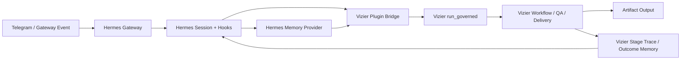

# Hermes × Vizier Integration Plan

> **For agentic workers:** This plan is meant to strengthen the current
> Vizier-on-Hermes architecture, not replace it. Keep Vizier's governed
> artifact runtime intact unless a step explicitly says to move behavior onto a
> Hermes seam.

**Goal:** Integrate Vizier more deeply with Hermes so that Hermes handles the
outer session, hook, memory, and gateway concerns it is already good at, while
Vizier remains the inner governed production engine for artifact quality,
routing, and delivery.

**Primary outcome:** Hermes and Vizier stop acting like loosely coupled layers
with a black-box subprocess boundary and instead become a deliberate two-ring
runtime:

- **Outer ring:** Hermes owns chat sessions, gateway media intake, session
  lifecycle, plugin hooks, cross-session memory, and outer cost/session
  telemetry
- **Inner ring:** Vizier owns artifact routing, readiness, policy, template
  selection, quality gates, tripwire, rendering, and delivery

**Related reports:**

- `docs/VIZIER_QUALITY_SPINE_REMEDIATION_REPORT_2026-04-08.md`
- `docs/VIZIER_POSTER_RUNTIME_ENHANCEMENT_REPORT_2026-04-09.md`
- `docs/VIZIER_MEMPALACE_RUNTIME_ADOPTION_REPORT_2026-04-08.md`

**Bridge file currently in production:**

- `~/.hermes/plugins/vizier_tools/__init__.py`

---

## Why This Plan Exists

The Hermes audit showed three truths at the same time:

1. Vizier is already using Hermes correctly at the outer shell level.
2. Hermes has built-in features that can solve some of our current session,
   memory, feedback, and observability issues.
3. Vizier still runs as a single opaque subprocess tool from Hermes's point of
   view, so Hermes cannot help with most inner-stage behavior.

That means the right move is not "move everything into Hermes" and not "keep
adding custom Vizier glue forever." The right move is to cleanly define the
boundary.

---

## Current State

### What Hermes already does well for Vizier

- Gateway media intake, cached local image paths, and auto vision enrichment
- Session persistence, session resume, and context compression
- Plugin lifecycle hooks:
  - `pre_tool_call`
  - `post_tool_call`
  - `pre_llm_call`
  - `post_llm_call`
  - `on_session_start`
  - `on_session_end`
- External memory-provider lifecycle:
  - `prefetch`
  - `sync_turn`
  - `on_pre_compress`
  - `on_session_end`
- Session-level token and cost tracking

### What Vizier already does well

- Governed routing, readiness, and policy
- Artifact-specific workflow execution
- Quality spine, tripwire, guardrails, and delivery logic
- Poster-first runtime optimization and reference adaptation
- Runtime controls, budget profiles, and layered stage knowledge
- Artifact-specific trace and improvement data

### Current integration weakness

The live Hermes plugin calls Vizier through one top-level `run_pipeline` tool,
which shells out to `run_governed(...)`. This creates a black-box boundary:

- Hermes sees one tool call
- Vizier sees the real production stages
- session metadata and attachments do not cross the boundary cleanly
- Hermes hooks do not observe Vizier's inner stages
- Hermes cost/usage metrics stop at the bridge

---

## Design Principles

### Principle 1: Keep the inner artifact engine in Vizier

Do not migrate routing, workflow execution, QA, template selection, rendering,
or tripwire into Hermes. Those are Vizier's core product semantics.

### Principle 2: Move session and lifecycle concerns onto Hermes seams

If a concern is primarily about chat sessions, gateway events, user memory,
session compression, or plugin lifecycle, prefer Hermes-native hooks/providers
over new custom Vizier infrastructure.

### Principle 3: Prefer explicit boundaries over hidden parsing

Regex-parsing gateway-enriched request text was a good bridge fix, but it
should not remain the long-term contract for reference images, platform, or
feedback signals.

### Principle 4: Use Hermes memory for session/operator memory, not artifact corpus

Hermes memory providers are a good fit for:

- operator preferences
- client/operator corrections
- approval feedback
- persistent session facts
- pre-compression extraction

They are **not** the right replacement for Vizier's knowledge cards,
exemplars, swipes, or artifact retrieval corpus.

### Principle 5: Avoid duplicate telemetry stacks

Hermes should own outer session-level telemetry. Vizier should own artifact and
stage-level telemetry. The integration point should link them, not duplicate
them.

---

## Target Architecture

### Boundary contract

Hermes should provide to Vizier:

- session ID
- platform
- attachment metadata
- gateway-enriched image/audio hints
- cross-session operator/client memory
- outer token/session cost data

Vizier should provide back to Hermes:

- workflow chosen
- artifact family
- quality summary
- delivery outcome
- inner token/cost summary
- reference/template/design-system metadata

---

## Execution Order

1. Stabilize the plugin seam and start using hooks
2. Replace brittle attachment parsing with structured bridge data
3. Add Hermes-backed session/operator memory integration
4. Link Vizier stage telemetry back into Hermes session telemetry
5. Tighten compression and feedback lifecycle behavior
6. Re-evaluate whether any inner Vizier stages should ever become Hermes-native

---

## Chunk 0: Guardrails For This Work

### Rules

- Do not remove the existing governed Vizier runtime
- Do not replace Vizier knowledge cards with a Hermes memory provider
- Do not introduce a second "context control" stack beside Vizier runtime
  controls
- Do not couple Telegram-specific logic into the Vizier core runtime
- Do not reimplement Hermes session persistence inside Vizier

### Scope

This plan improves integration, not product behavior by itself. The result
should be stronger session continuity, better attachment handling, better
feedback/memory flow, and better cross-layer telemetry.

---

## Chunk 1: Use Hermes Hooks In The Live Vizier Plugin

### Objective

Stop treating the plugin as tool-registration-only. Start using Hermes's
existing hook lifecycle to enrich Vizier turns and capture outcomes.

### Files

- Modify: `~/.hermes/plugins/vizier_tools/__init__.py`
- Reference: `hermes-agent/hermes_cli/plugins.py`
- Reference: `hermes-agent/run_agent.py`

### Changes

Register these hooks in the live plugin:

- `pre_llm_call`
  - parse current session/user/platform context
  - optionally inject a short ephemeral hint that teaches the agent how to use
    `run_pipeline` better for image-bearing artifact requests
- `post_llm_call`
  - record assistant-side outcome summaries for analytics
- `on_session_start`
  - initialize session-local Vizier bridge state
- `on_session_end`
  - flush bridge-local telemetry or feedback summaries

### Why this matters

This gives us a Hermes-native place to:

- bias the model toward structured Vizier tool usage
- attach platform hints without overloading the tool schema
- record feedback/outcome metadata without patching Hermes core

### Success criteria

- the plugin uses Hermes hooks, not just tool registration
- hook failures remain non-fatal
- no change to the governed inner runtime contract

---

## Chunk 2: Replace Regex Attachment Recovery With A Structured Bridge

### Objective

Stop depending on request-text parsing for Telegram poster references.

### Files

- Modify: `~/.hermes/plugins/vizier_tools/__init__.py`
- Potential Hermes seam work:
  - `hermes-agent/gateway/run.py`
  - `hermes-agent/model_tools.py`
  - possibly plugin hook payloads if needed

### Current problem

Today, the plugin recovers `reference_image_path` by regex-parsing gateway text
that contains a cached image path. This works, but it is a compatibility hack.

### Desired contract

The Vizier plugin should receive structured media context, such as:

- `media_urls`
- `media_types`
- `primary_image_path`
- `primary_image_url`
- optionally `vision_summary`

### Recommended implementation path

Phase 1:

- keep the current regex fallback
- add a structured plugin-side envelope if Hermes already exposes enough data
  in hook payloads or tool kwargs

Phase 2:

- extend Hermes so plugin tool handlers or hook callbacks can access structured
  media metadata from the current gateway event/session

### Success criteria

- poster reference intake no longer depends solely on free-text parsing
- Telegram and future media-rich platforms share one clean bridge contract

---

## Chunk 3: Add Hermes-Backed Session Memory For Operator And Feedback Signals

### Objective

Use Hermes memory-provider lifecycle for cross-session memory that actually
belongs at the session/operator layer.

### Files

- New Hermes memory provider plugin or adapter
- Reference:
  - `hermes-agent/agent/memory_provider.py`
  - `hermes-agent/agent/memory_manager.py`
- Vizier touchpoints:
  - `tools/knowledge.py`
  - `tools/improvement.py`
  - `tools/orchestrate.py`

### What should move onto Hermes memory

- operator preferences
- client-specific corrections that repeat across jobs
- approval or rejection summaries
- feedback like "prefer brighter hero images" or "avoid cluttered CTA blocks"
- session-end extracted facts

### What should stay in Vizier

- knowledge cards
- exemplars
- swipe bank
- artifact outputs
- job traces
- stage quality metrics

### Integration model

Hermes memory provider:

- `prefetch(...)`
  - return short operator/client/session memory relevant to the current request
- `sync_turn(...)`
  - persist approved facts or stable preferences
- `on_pre_compress(...)`
  - save useful state before Hermes compression discards detail
- `on_session_end(...)`
  - run extraction or summarization

Vizier runtime:

- still owns artifact-specific retrieval and quality memory
- may optionally consume a short Hermes memory block as outer context

### Success criteria

- feedback and preference memory survive across Telegram sessions
- compression no longer risks losing the most important operator signals
- no attempt to replace Vizier's corpus with Hermes memory

---

## Chunk 4: Link Inner Vizier Telemetry Back Into Hermes

### Objective

Make Hermes session telemetry and Vizier artifact telemetry reference each
other instead of living in isolation.

### Files

- Modify: `~/.hermes/plugins/vizier_tools/__init__.py`
- Modify: `contracts/trace.py`
- Modify: `tools/executor.py`
- Modify: `tools/orchestrate.py`
- Potential Hermes reporting touchpoints:
  - `hermes-agent/hermes_state.py`
  - `hermes-agent/agent/insights.py`

### Required linkage

For each governed run, capture and correlate:

- Hermes session ID
- Vizier job ID
- workflow
- artifact family
- budget profile
- quality posture
- final QA summary
- delivery outcome
- Vizier inner token/cost totals

### Desired result

Hermes can answer:

- which sessions triggered poster generation
- how many jobs succeeded vs failed
- rough cost per governed job

Vizier can answer:

- which Telegram/CLI session a job came from
- what outer session context existed
- how session-level behavior affected artifact quality

### Success criteria

- every governed job can be traced back to a Hermes session
- every relevant Hermes session can point to a governed job outcome

---

## Chunk 5: Formalize Compression And Feedback Lifecycle

### Objective

Use Hermes lifecycle seams for session-level save/flush behavior instead of
building more one-off runtime hacks.

### Files

- Hermes memory/provider layer
- Hermes plugin hooks
- Vizier outcome and exemplar promotion logic

### Changes

- decide which operator/client facts must be saved on:
  - `on_pre_compress`
  - `on_session_end`
- define what approval or revision signals are persisted to Hermes memory
- define what still belongs only in Vizier outcome memory

### Important distinction

Hermes should preserve the **session memory signal**.
Vizier should preserve the **artifact improvement signal**.

### Success criteria

- compression-safe operator memory
- explicit route from approval feedback to both Hermes session memory and
  Vizier improvement systems where appropriate

---

## Chunk 6: Revisit The Black-Box Boundary

### Objective

Decide how much of Vizier should remain behind one subprocess bridge.

### Options

#### Option A: Keep the subprocess boundary, improve metadata exchange

Pros:

- lowest risk
- preserves Vizier isolation
- avoids namespace/runtime conflicts

Cons:

- Hermes still cannot observe inner stages directly

#### Option B: Expose selected stable Vizier capabilities as Hermes-native tools

Candidates:

- reference analysis
- template preview selection
- artifact status query
- delivery summary query

Pros:

- better Hermes observability
- easier session-native interactions

Cons:

- more surface area to maintain
- higher coupling risk

#### Option C: Fully embed Vizier workflows into Hermes tool loop

Do **not** do this now.

This would duplicate governed runtime behavior and create a second orchestration
model before the current one has matured enough.

### Recommended position

Stay on **Option A** for now, with a small move toward **Option B** only for
metadata-rich helper capabilities, not the full workflow engine.

---

## Risks

### Risk 1: Over-coupling Vizier to Hermes internals

Mitigation:

- keep artifact generation logic inside Vizier
- keep Hermes usage focused on hooks, memory, session, and gateway seams

### Risk 2: Two memory systems fighting each other

Mitigation:

- clearly separate session/operator memory from artifact corpus memory
- document ownership per data type

### Risk 3: Plugin complexity drifting outside version control

Mitigation:

- mirror the live plugin source into repo documentation or an integration
  directory
- treat `~/.hermes/plugins/vizier_tools/__init__.py` as a deployment target, not
  the only source of truth

### Risk 4: Attachment bridge drift

Mitigation:

- preserve the regex fallback until structured attachment metadata is live
- add tests around the structured bridge once introduced

---

## Recommended Implementation Order

1. Add Hermes hooks to the live Vizier plugin
2. Create a structured attachment/media bridge plan and land the first safe
   seam
3. Implement Hermes-backed operator/session memory
4. Link Vizier job IDs and Hermes session IDs
5. Formalize compression-safe feedback handling
6. Reassess whether any helper capabilities should become Hermes-native tools

---

## What "Better Integration" Should Mean After This Plan

Before:

- Hermes runs the chat shell
- Vizier runs the production engine
- the bridge is mostly one tool call plus request text parsing

After:

- Hermes understands more about each governed Vizier run
- Vizier receives better structured session, platform, and media context
- cross-session memory and compression-safe facts live on Hermes seams
- artifact-level quality and delivery still remain under Vizier governance
- the two systems reinforce each other instead of overlapping awkwardly

